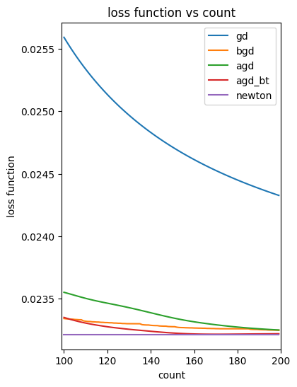
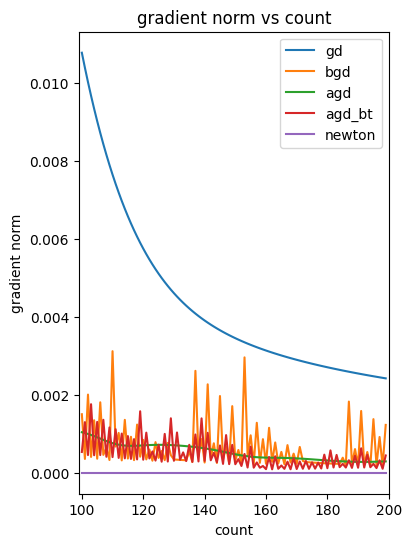
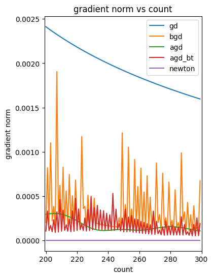
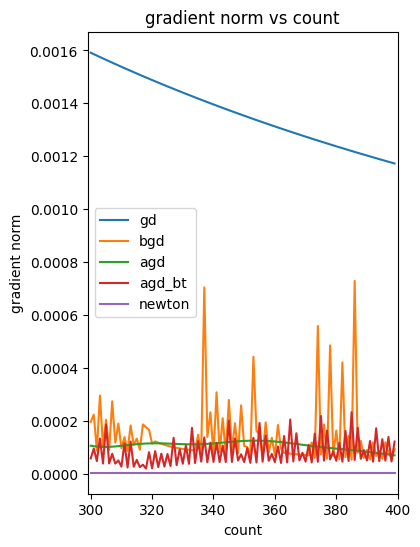
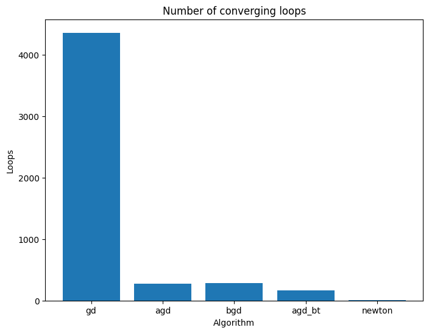
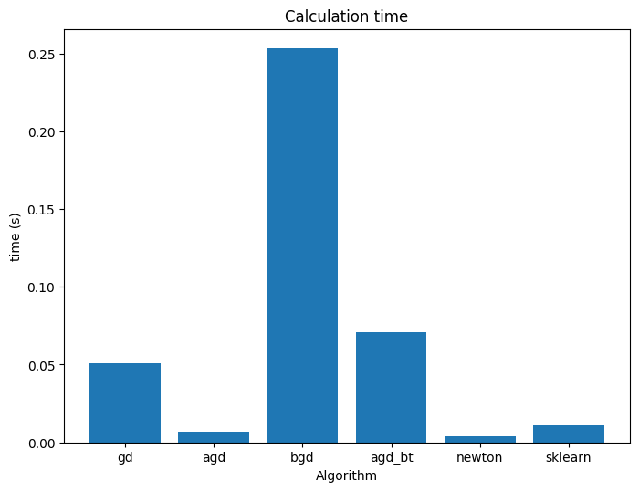

## Dự đoán giá nhà
### Mô hình Linear Regression

---

## Dữ liệu đầu vào

- Kc_house_data.csv - https://www.kaggle.com/datasets/swathiachath/kc-housesales-data

- 21 variables and 21613 observations

- Xử lý dữ liệu:
    - Bỏ các trường: id, datetime, vị trí (chưa phân loại)
    - Thêm các trường: years_built, years_renovated
    - Chuẩn hóa $X = (X - X_{min}) / (X_{max} - X_{min})$
    - Scale: $y = y/1e6$

---
## Chuẩn bị dữ liệu

- $X$: ma trận $N \times 16$ (thêm 1 cột cho hệ số tự do)

- $y$: vector $N \times 1$

- Chia tập train - test theo tỉ lệ $80/20$

---
## Loss function, Gradient, Hessian

- Loss function: $f(w) = 1/2 \lVert y - Xw \rVert ^2$

- Gradient: $\nabla f(w) = X^T X w - X^T y$

- Hessian: $H = X^T X$

---
## Thuật toán GD

- Công thức cập nhật: $w^{(+)} = w - t \nabla f(w)$

- Backtracking: 
    - Với $f(w^{(+)}) > f(w) - t \nabla f(w)$
    - Lấy $t = \beta t$ với $\beta < 1$ và lặp lại

---
## Thuật toán Accelerated GD

- Chọn điểm bắt đầu $w^{(0)} = w^{(-1)}$, lặp lại:

    - $v = w^{(k - 1)} + \frac{k-2}{k+1} (w^{(k - 1)} - w^{(k - 2)})$

        $w^{(k)} = v - t_{k}\nabla f(v)$

        với $k = 1,2,3,...$

    - Backtracking:
        - Với $f(w^{(+)}) > f(v) + \nabla f(v)^T (w^{(+)} - v) + \frac{1}{2t} \lVert w^{(+)} - v \rVert ^2$

        - Lấy $t = \beta t$ ($\beta < 1$) và  $w^{(+)} = v - t \nabla f(v)$, lặp lại

---
## Thuật toán Newton

- Ta biết rằng với bài toán Least square, nghiệm tối ưu là nghiệm của hệ tuyến tính $X^T X w = X^T y$ hay $w = (X^T X)^{-1}X^T y$

- Thay $\nabla f(w) = X^T X w - X^T y$ và $H = X^T X$ vào công thức cập nhật của thuật toán Newton ta được:

$w^{(1)} = w^{(0)} - (X^T X)^{-1} (X^T X w^{(0)} - X^T y)$

hay $w^{(1)} = (X^T X)^{-1}X^T y$, chính là công thức nghiệm tối ưu

- Nghĩa là, với điểm bắt đầu bất kì và độ dài bước bằng 1, thuật toán Newton cho nghiệm tối ưu sau chỉ 1 bước cập nhật!

---
## Cấu hình

- $w^{(0)} = 0$, $tol = 10^{-4}$

- GD: $t = 1$

- GD backtracking: $t = 128$, $\beta = 0.5$

- Accelerated GD: $t = 0.6$

- Accelerated GD backtracking: $t = 3$, $\beta = 0.5$

---
## Kết quả benchmark - Loss Function
 

---
## Kết quả benchmark - Loss Function
 

---
## Kết quả benchmark - Gradient norm
 

---
## Kết quả benchmark - Gradient norm
 

---
## Số bước hội tụ
| Thuật toán | Số bước hội tụ |
|-------------------|----------------|
| GD                | 4358           |
| Accelerated GD    | 278            |
| GD backtracking   | 286            |
| AGD backtracking  | 161            |
| Newton            | 2              |

---
## Số bước hội tụ

---
## Thời gian tính toán
| Thuật toán | Thời gian |  Tỉ lệ với sklearn
|-------------------|----------------|--------------|
| GD                | 2.6423         |  123.0667    |
| Accelerated GD    | 0.1749         |  8.1463      |
| GD backtracking   | 1.0022         |  46.6787     |
| AGD backtracking  | 0.5875         |  27.3649     |
| Newton            | 0.0048         |  0.2254      |
| Sklearn           | 0.0215         |  1           |

---
## Thời gian tính toán

---
## Q & A